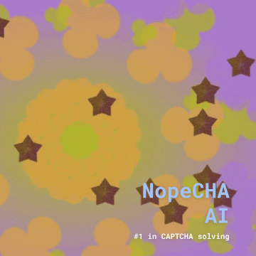
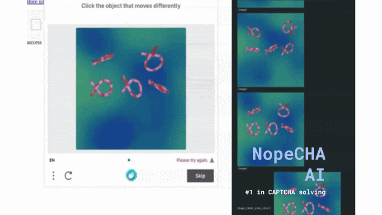

 

    <picture>
        <source media="(prefers-color-scheme: dark)" srcset="assets/nopecha_1600x900.jpg?raw=true">
        
    </picture>

<h3 align="center">
Easy, fast, and cheap CAPTCHA automation for everyone.
</h3>

| <a href="https://nopecha.com/api-reference/"><b>API Reference</b></a>
| <a href="https://nopecha.com/docs/"><b>Documentation</b></a>
| <a href="https://nopecha.com/captcha"><b>CAPTCHA Demo</b></a>
| <a href="https://nopecha.com/discord"><b>Developer Discord</b></a> |

<!--  -->
<!--  -->
<!--  -->
<!--  -->
<!--  -->

    
    
    
    
    

---

*Latest News* 🔥

- [2025/11] Released [0.5.3](https://github.com/NopeCHALLC/nopecha-extension/releases/tag/0.5.3) adding support for hCaptcha video challenges and improved click precision; introduced online RL for browser agents. See the release notes [here](https://github.com/NopeCHALLC/nopecha-extension/releases/tag/0.5.3).
- [2025/11] Released [0.5.2](https://github.com/NopeCHALLC/nopecha-extension/releases/tag/0.5.2) fixing hCaptcha drag-and-drop coordinate rescaling on small viewports, Turnstile checkbox detection on Cloudflare interstitial pages, improving Turnstile bounding boxes, hardening reCAPTCHA flows, and restoring GeeTest. See the updated API reference [here](https://nopecha.com/api-reference/).
- [2025/11] Released [0.5.1](https://github.com/NopeCHALLC/nopecha-extension/releases/tag/0.5.1) to adapt to hCaptcha’s new coordinate system post 0.5.0. See the notes [here](https://github.com/NopeCHALLC/nopecha-extension/releases/tag/0.5.1).
- [2025/11] Released [0.5.0](https://github.com/NopeCHALLC/nopecha-extension/releases/tag/0.5.0) introducing new AI models for hCaptcha and general computer use (invite-only beta), plus Turnstile fixes, performance, and stability improvements. Notes [here](https://github.com/NopeCHALLC/nopecha-extension/releases/tag/0.5.0).

Previous News

- [2024/11] Released [0.4.13](https://github.com/NopeCHALLC/nopecha-extension/releases/tag/0.4.13) fixing Cloudflare Turnstile, improving GeeTest recognition, and delivering performance and stability improvements.
- [2024/06] Released [0.4.12](https://github.com/NopeCHALLC/nopecha-extension/releases/tag/0.4.12) fixing Cloudflare Turnstile.
- [2024/06] Released [0.4.11](https://github.com/NopeCHALLC/nopecha-extension/releases/tag/0.4.11) fixing the reCAPTCHA language code.
- [2024/06] Released [0.4.10](https://github.com/NopeCHALLC/nopecha-extension/releases/tag/0.4.10) adding beta support for GeeTest, Lemin, and Yandex CAPTCHAs; plus fixes for AWS CAPTCHA and Cloudflare Turnstile, and stability improvements.
- [2024/05] Released [0.4.9](https://github.com/NopeCHALLC/nopecha-extension/releases/tag/0.4.9) adding retry delay to avoid rate limits, fixing icon text overflow, and improving stability.
- [2024/04] Released [0.4.8](https://github.com/NopeCHALLC/nopecha-extension/releases/tag/0.4.8) fixing AWS WAF loop; improving AWS WAF, hCaptcha, and reCAPTCHA recognition; plus performance and minor bug fixes.
- [2023/11] Released [0.4.7](https://github.com/NopeCHALLC/nopecha-extension/releases/tag/0.4.7) adding CSS selector extraction via UI and a disabled hosts menu; fixing Text CAPTCHA input, duplicate AWS WAF API calls, and Firefox logs; with performance and stability improvements.
- [2023/11] Released [0.4.6](https://github.com/NopeCHALLC/nopecha-extension/releases/tag/0.4.6) with a UI redesign, Settings API logs, an incognito bug fix, and major stability improvements.
- [2023/10] Released [0.4.5](https://github.com/NopeCHALLC/nopecha-extension/releases/tag/0.4.5) fixing empty image data in POST and PerimeterX on several domains; stability improvements.
- [2023/10] Released [0.4.4](https://github.com/NopeCHALLC/nopecha-extension/releases/tag/0.4.4) fixing Draw a box around challenges; minor stability improvements.
- [2023/10] Released [0.4.3](https://github.com/NopeCHALLC/nopecha-extension/releases/tag/0.4.3) adding support for a new hCaptcha API function.
- [2023/10] Released [0.4.2](https://github.com/NopeCHALLC/nopecha-extension/releases/tag/0.4.2) improving hCaptcha area select recognition and fixing minor bugs.
- [2023/10] Released [0.4.1](https://github.com/NopeCHALLC/nopecha-extension/releases/tag/0.4.1) maintenance update.
- [2023/10] Released [0.4.0](https://github.com/NopeCHALLC/nopecha-extension/releases/tag/0.4.0) maintenance update.
- [2023/04] Released [0.3.13](https://github.com/NopeCHALLC/nopecha-extension/releases/tag/0.3.13) maintenance update.
- [2023/04] Released [0.3.12](https://github.com/NopeCHALLC/nopecha-extension/releases/tag/0.3.12) maintenance update.
- [2023/04] Released [0.3.11](https://github.com/NopeCHALLC/nopecha-extension/releases/tag/0.3.11) maintenance update.
- [2023/04] Released [0.3.10](https://github.com/NopeCHALLC/nopecha-extension/releases/tag/0.3.10) maintenance update.
- [2023/04] Released [0.3.9](https://github.com/NopeCHALLC/nopecha-extension/releases/tag/0.3.9) maintenance update.
- [2023/03] Released [0.3.8](https://github.com/NopeCHALLC/nopecha-extension/releases/tag/0.3.8) fixing an hCaptcha multiple choice bug.
- [2023/03] Released [0.3.7](https://github.com/NopeCHALLC/nopecha-extension/releases/tag/0.3.7) maintenance update.
- [2023/03] Released [0.3.6](https://github.com/NopeCHALLC/nopecha-extension/releases/tag/0.3.6) maintenance update.
- [2022/12] Major commit [textcaptcha empty selectors](https://github.com/NopeCHALLC/nopecha-extension/commit/6d97479) improving Text CAPTCHA selector handling.
- [2022/12] Major commit [popup mods, auth header](https://github.com/NopeCHALLC/nopecha-extension/commit/aa9f7e7) updating popup UI and authentication headers.
- [2022/11] Major commit [BG API, reCAPTCHA visibility check, Firefox bug fix](https://github.com/NopeCHALLC/nopecha-extension/commit/bfa8a97) adding background API functions, improving reCAPTCHA visibility checks, and fixing Firefox issues.
- [2022/11] Major commit [add disabled hosts](https://github.com/NopeCHALLC/nopecha-extension/commit/bf304de) introducing a disabled hosts list.
- [2022/11] Major commit [add custom solve delay input](https://github.com/NopeCHALLC/nopecha-extension/commit/b572421) exposing a configurable solve delay.
- [2022/11] Major commit [Popup (#21)](https://github.com/NopeCHALLC/nopecha-extension/commit/31daddb) introducing a new popup interface.
- [2022/11] Major commit [add aws waf](https://github.com/NopeCHALLC/nopecha-extension/commit/a062b67) adding first class automation for AWS WAF challenges.
- [2022/10] Major commit [locator iframes & add funcaptcha demo](https://github.com/NopeCHALLC/nopecha-extension/commit/188421b) enhancing iframe injection and adding a FunCaptcha demo.
- [2022/10] Major commit [ocr autodetect WIP](https://github.com/NopeCHALLC/nopecha-extension/commit/14de746) adding OCR auto detection groundwork.
- [2022/10] Major commit [ocr base64 from canvas](https://github.com/NopeCHALLC/nopecha-extension/commit/f1883e1) implementing base64 OCR extraction from canvas.

---

## About

NopeCHA is a **free-to-use** and **fully automatic** CAPTCHA solver powered by multimodal AI through the [NopeCHA API platform](https://nopecha.com/api-reference/).

### Why NopeCHA?

- Staying up-to-date with frequently changing CAPTCHA challenges can be tedious.
- Our extensions, libraries, and API receive regular updates to keep up with the latest challenges, ensuring uninterrupted service for your workflow.
- Load our extension in an automated browser like Selenium and watch it solve CAPTCHAs on any website you visit. No need to write custom code to bypass CAPTCHAs.
- Use our API endpoints or Python and Node.js libraries use in custom applications, scripts, or bots.
- Our AI is state-of-the-art. Behind the scenes, we use browsers controlled by AI agents to collect feedback by interacting with real CAPTCHAs. Then, the AI agents use this experience to update their policies, continuously and autonomously. The moment a new CAPTCHA is released, our models are already learning to solve it. Our robust and powerful online RL pipeline allows us to stay ahead of the curve and offer the lowest prices on the market.

Find the full list of supported CAPTCHAs [here](https://developers.nopecha.com/captcha/).

 

## Getting Started

The fastest way to start is to install our browser extension that automatically detects and solves CAPTCHAs present on the page. It works in both Chrome and Firefox, including all Chromium-based automation tools like Puppeteer and Selenium.

    <a href="https://www.nopecha.com/chrome">
         Chrome Extension
    </a>
    &nbsp; &nbsp;
    <a href="https://www.nopecha.com/firefox">
         Firefox Add-on
    </a>

Free to use for up to 100 requests per day. No sign-up or API key needed! Just install our extension and it will work instantly on any CAPTCHA it detects.

> *Note: requests made without an API key counts usage by IP address.*

For higher limits and more features, sign up at <a href="https://nopecha.com">NopeCHA.com</a> to create an API key.

 

For developers integrating NopeCHA into their projects, please see our <a href="https://nopecha.com/docs/">Documentation</a> and <a href="https://nopecha.com/api-reference/">API reference</a>.

 

### Supported CAPTCHA Types

Here is a sample of CAPTCHA types supported by NopeCHA, with more added regularly:

| reCAPTCHA | FunCAPTCHA |
:-:|:-:
 | 

| hCaptcha | AWS WAF |
:-:|:-:
 | 

| Text CAPTCHA | Cloudflare Turnstile |
:-:|:-:|
 | 

| And more ... | |
:-:|:-:
 | 
<!--  -->

 

## Resources

- [See our latest release notes](https://github.com/NopeCHALLC/nopecha-extension/releases) for the most recent updates and new features.
- [View API reference](https://nopecha.com/api-reference/) for the full list of supported endpoints and CAPTCHAs.
- [View documentation](https://nopecha.com/docs/) for guides on how to automate using the NopeCHA extension.
- [Visit our website](https://nopecha.com) for more information about our services and to sign up for an API key.

---

 

## About our Transition to Closed Source in 2023

Read more

### Why Closed Source?

In early 2023, hCaptcha and FunCAPTCHA added a hardcoded check to detect NopeCHA v0.3.x and open-source softwares developed by NopeCHA, LLC.
This attention validates our impact.
To maintain our edge without offering CAPTCHA providers a counter-strategy, we have chosen to restrict source code access.

### What Changed

We continue to publish the latest builds under <a href="../../releases">GitHub releases</a> and in the Chrome Web Store and Mozilla Add-on store, but the source code is no longer publicly available.

### The Road Ahead

We are committed to expanding support across CAPTCHA providers and improving accuracy, throughput, and cost efficiency.

Thanks for your support.

 

